# MA : ON

## 삼성 청년 SW아카데미(SSAFY) 자율 프로젝트

  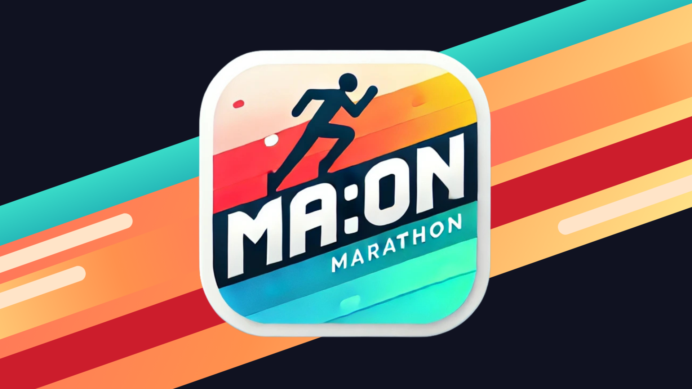

## 📆 프로젝트 진행 기간

2024.10.14 ~ 2024.11.19 (5주)

## 🫂 멤버소개

  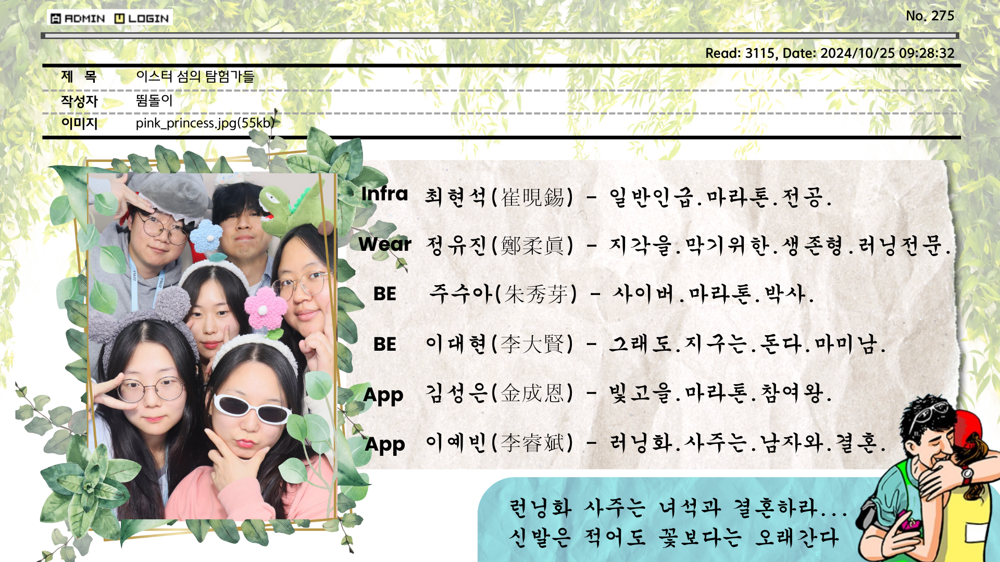

## 🤸‍♂️ 기술스택

<table>
    <tr>
        <td><b>Back-end</b></td>
        <td>

 

 

</td>
    </tr>
    <tr>
    <td><b>Front-end</b></td>
    <td>

    </td>
    </tr>
    <tr>
    <td><b>Watch</b></td>
    <td>
    
    
    </td>
    </tr>
    <tr>
    <td><b>Infra</b></td>
    <td>

</td>
    <tr>
    <td><b>Tools</b></td>
    <td>

    
    

    </td>
    </tr>
</table>

## 🛠️ 시스템 아키텍쳐

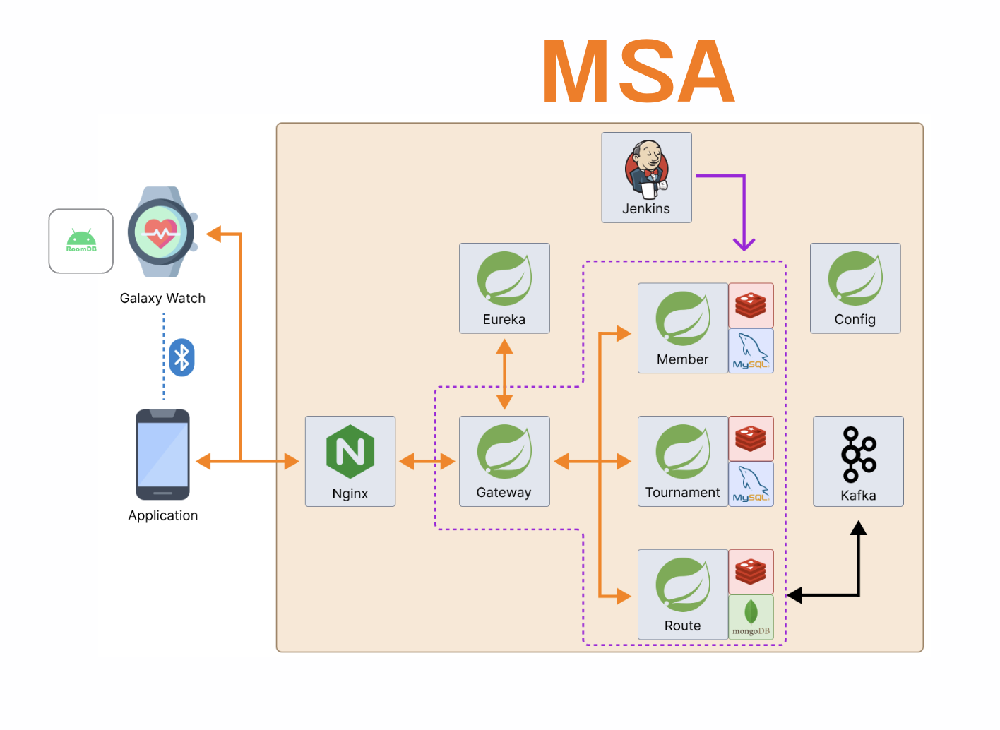

## 💳 프로젝트 소개

### 🚩 서비스 한줄 소개

마라토너와 러닝인들를 위한
마라톤 특화 러닝 앱

 

### 기획의도 및 배경

국내 마라톤 시장은 꾸준히 성장하고 있습니다. 
마라토너들의 필수 사이트로 불리는 마라톤 정보 포털 마라톤 온라인의 통계에 따르면, 
2022년 국내에서 열린 마라톤은 총 346개였고,2023년에는 389개로 늘어났습니다. 
2024년 현재는 이미 402개의 대회 일정이 등록되어 있어 마라톤 참여 열기가 점점 높아지고 있음을 보여줍니다.
   
그러나 이렇게 마라톤 대회 수가 증가하고 있음에도 불구하고, 마라톤에 특화된 통합 플랫폼은 부재한 상황입니다. 
대회 정보를 얻기 위해 여러 사이트를 찾아야 하고, 참가 신청 과정도 불편하며, 훈련 루트와 기록 관리 역시 흩어져 있는 서비스들을 개별적으로 이용해야 합니다.
   
MA:ON은 이러한 문제를 해결하고자 기획되었습니다.  
단순한 러닝 기록 앱이 아니라, 마라톤 러너들이 훈련에서 대회 참가까지 전 과정을 효율적이고 즐겁게 경험할 수 있도록 돕는 플랫폼을 지향합니다. 
러너들이 마라톤을 준비하고 즐기는 과정에서 겪는 불편함을 최소화하고, 더 나은 경험을 제공하는 것이 maon의 가장 큰 목표입니다.

 

### 문제제기

**[문제제기 1]**
대회 정보를 얻기 위해 여러 사이트를 찾아야 하고, 참가 신청 과정도 불편하다.

**[문제제기 2]**
마라톤과 동일한 경로에 대한 훈련 서비스가 존재하지 않는다.

 
 

### 솔루션 도출

1. 전국 대회 탐색 및 신청을 하나의 플랫폼에서 진행할 수 있도록 한다.
2. 훈련 기능을 추가하여 경로 훈련 시 이탈 판단 로직을 구현하여 사용자가 러닝 도중 경로를 이탈했을 시 알림을 통해 실시간으로 경로 이탈 상황을 알린다.

 
 

### 서비스 목적

마라톤 러너들이 훈련 → 대회 탐색 → 참가 신청 → 기록 관리까지 전 과정을 한곳에서 해결할 수 있는 종합 플랫폼을 제공한다.

 
 

### 기대효과

1. 편리한 마라톤 준비 환경 제공
    훈련 루트, 대회 정보, 참가 신청, 기록 관리까지 한 곳에서 해결 가능하여 러너들의 불편함을 최소화합니다.

2. 마라톤 참여 인구 확대
    초보자도 쉽게 대회 정보를 접하고 참가할 수 있어 마라톤 대회의 저변 확대와 활성화에 기여합니다.

3. 러너 커뮤니티 활성화
    루트 공유와 기록 관리 기능을 통해 러너 간 교류를 촉진하고, 마라톤 문화를 더욱 풍성하게 만듭니다.

 
 

## ✅ 기능 소개

### 로그인 및 메인화면

<table>    
    <tr align="center"> 
        <td><strong> 초기 화면 </strong></td>
        <td><strong>메인 화면</strong></td>
    </tr>
    <tr align="center"> 
        <td> 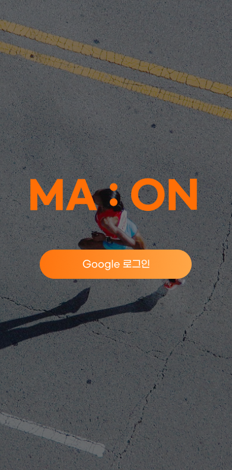 </td>
        <td> 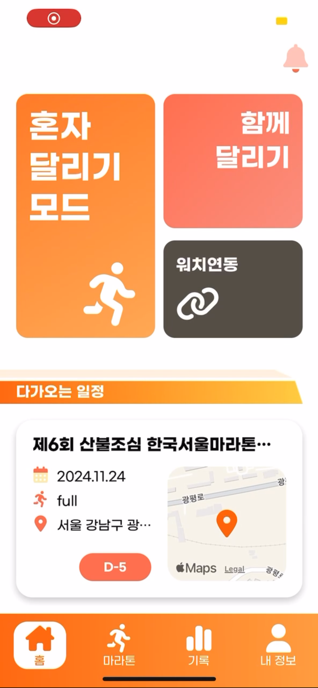 </td>
    </tr>
    <tr> 
        <td>
            사용자는 구글 계정을 통해 간편하게 회원가입 및 로그인이 가능할 수 있다.
        </td>
        <td>
        사용자는 달리기 모드 선택이 가능하고  자신이 신청한 마라톤 정보을 메인 화면에서 간략하게 볼 수 있다.  
        </td>
    </tr>
</table>

### 지정코스로 달리기

<table>    
    <tr align="center" > 
        <td><strong>달리기 모드 선택</strong></td>
        <td><strong>시작 지점으로 이동하기</strong></td>
        <td><strong>런닝 시작 버튼 누르기</strong></td>
        <td><strong>경로따라 달리기</strong></td>
    </tr>
    <tr align="center"> 
        <td> 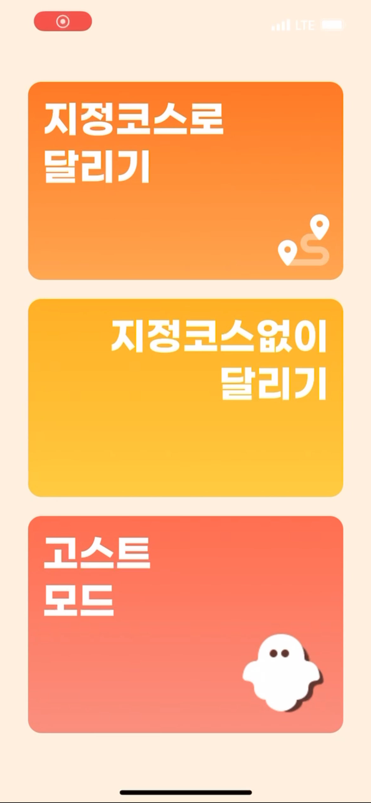 </td>
        <td> 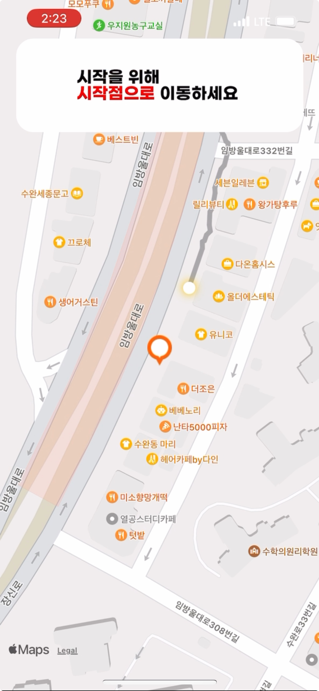 </td>
        <td> 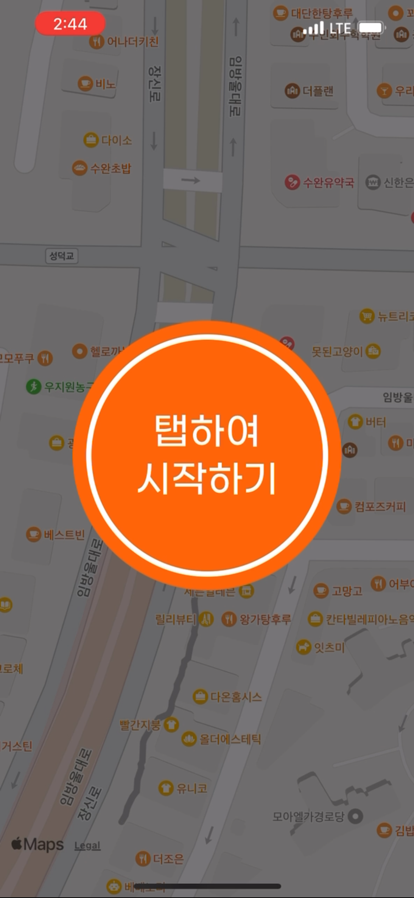 </td>
        <td> 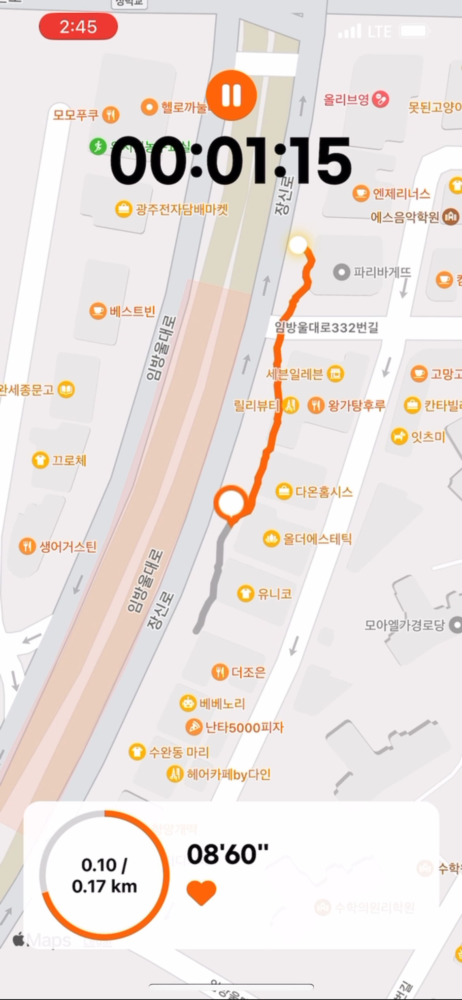 </td>
    </tr>
    <tr>
        <td>
        달리기 모드 선택에서 지정코스로 달리기를 선택한다. 
        이후 경로 리스트에서 달릴 경로를 선택한다.
        </td>
        <td>
        경로의 시작점으로 이동한다. 
        </td>
         <td>
        경로의 시작점으로 이동하면 달리기 버튼이 활성화된다. 
        버튼을 누른 후 3초 카운트 후 기록이 시작된다.
        </td>
         <td>
        달려야할 경로는 회색, 내가 달려온 경로는 주황색으로 표시된다. 
        달린 시간, 거리 및 심박수와 페이스 정보가 제공된다 
        경로를 이탈 한 경우 알림이 발생한다.
        </td>
    </tr>

</table>

### 지정코스 없이 달리기

<table>    
    <tr align="center" > 
        <td><strong>달리기 모드 선택</strong></td>
        <td><strong>달리기</strong></td>
    </tr>
    <tr align="center"> 
        <td>  </td>
        <td> 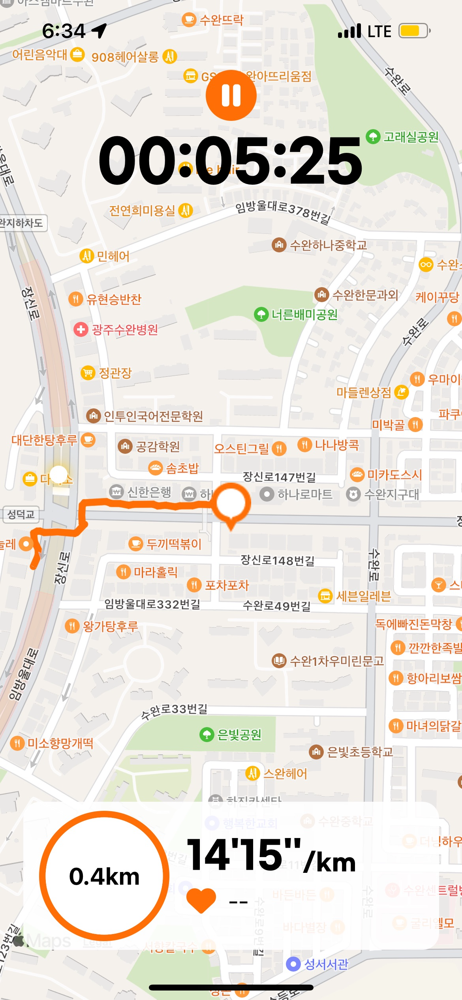 </td>
    </tr>
    <tr>
        <td>
        달리기 모드 선택에서 지정코스없이 달리기를 선택한다.
        </td>
         <td>
        탭하여 시작하기를 누른 뒤 달리기를 시작하면 
        내가 달린 거리가 주황색 폴리선으로 표시된다. 
        다른 모드와 동일하게 달린 시간, 거리 및 심박수와 페이스 정보가 제공된다.
        </td>
    </tr>

</table>

### 달리기 결과

<table>    
    <tr align="center"> 
        <td><strong> 달리기 결과 - 달리기 경로 </strong></td>
        <td><strong>달리기 결과 - 페이스 그래프</strong></td>
    </tr>
    <tr align="center"> 
        <td> 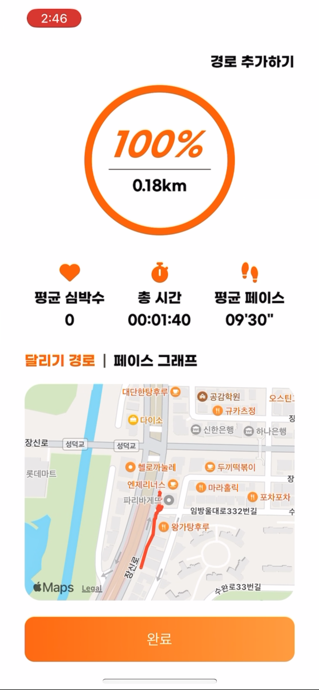 </td>
        <td> 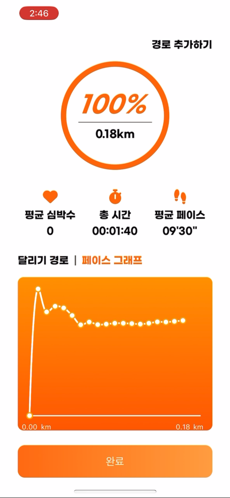 </td>
    </tr>
    <tr> 
        <td>
            사용자는 달린 시간, 평균 페이스 및 심박수와 
            자신이 달린 달리기 경로를 확인할 수 있다. 
            새로운 경로일 경우 자신만의 경로를 추가할 수 있다.
        </td>
        <td>
        사용자는 거리에 따른 페이스 변화를 그래프로 확인할 수 있다. 
        </td>
    </tr>
</table>

### 마라톤 정보 제공 및 팀 생성

<table>    
    <tr align="center" > 
        <td><strong>마라톤 정보</strong></td>
        <td><strong>팀 생성</strong></td>
        <td><strong>팀에 친구 초대</strong></td>
        <td><strong>초대 알림 리스트</strong></td>
    </tr>
    <tr align="center"> 
        <td> 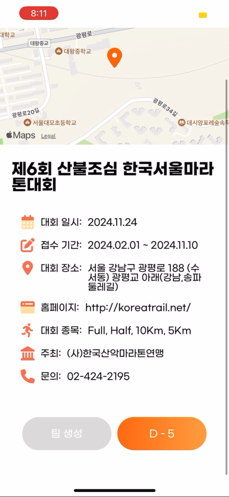 </td>
        <td> 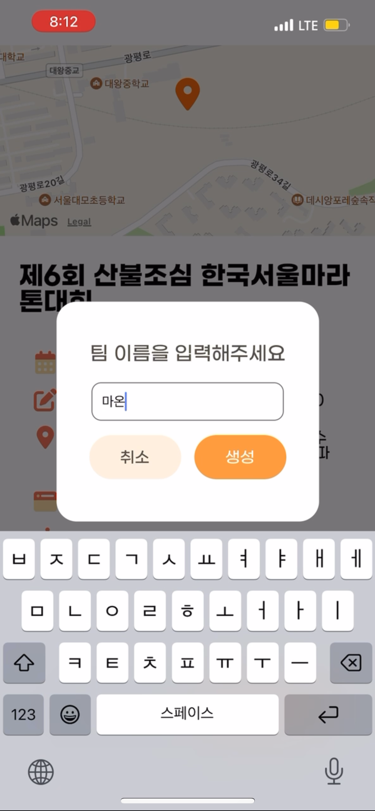 </td>
        <td> 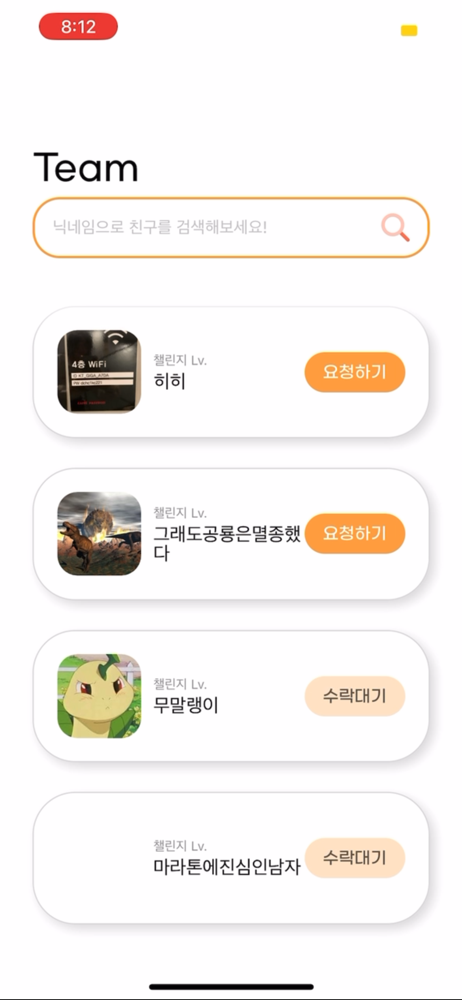 </td>
        <td>  </td>
    </tr>
    <tr>
        <td>
        참가 신청한 마라톤 대회의 상세 페이지에 들어가면  하단에 팀 생성 버튼이 존재
        </td>
        <td>
        팀 생성을 위한 이름 작성 후 
        생성하기 버튼을 누르면 팀이 생성된다.
        </td>
         <td>
        함께 참가하고 싶은 유저에게 요청하기를 누르면 
        초대 요청이 보내지고 수락대기로 변경된다.
        </td>
         <td>
        만약 다른 유저에게 팀 초대가 온 경우 
        알림 리스트에 뜨게 된다. 
        단 같은 대회에 각각 다른 유저가 초대한 경우 
        하나의 팀에만 참가가 가능하다.
        </td>
    </tr>

</table>

## 📕 산출물(ERD, 명세서, 파일구조)

### ERD

 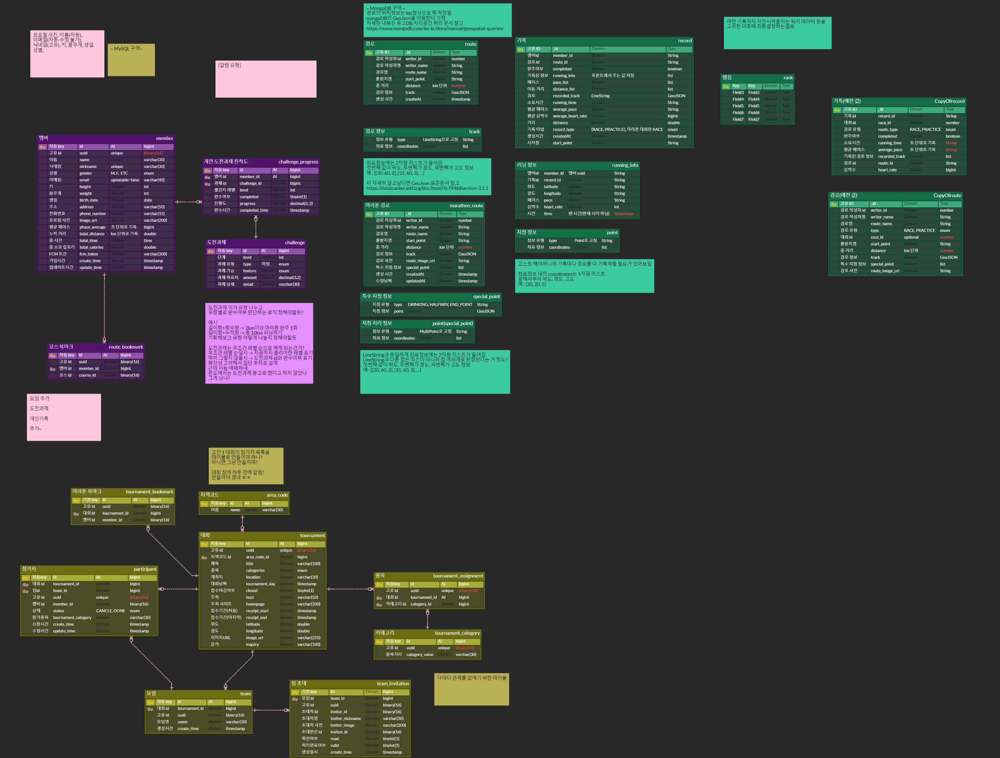

### 명세서

[API 명세서](https://docs.google.com/spreadsheets/d/1xHqWLq37ckSDkoltuPQX1Qg-oftulXuR1f5l1B_K1mA/edit?gid=0#gid=0)

## 💸 느낀점

## 발표자료

[ MA:ON 발표자료 ](https://www.canva.com/design/DAGWtkjskuo/7npvzs4_80Py4t1V6hqVKg/edit?utm_content=DAGWtkjskuo&utm_campaign=designshare&utm_medium=link2&utm_source=sharebutton)

## 🎬 UCC링크

[MA:ON Ucc](https://www.youtube.com/watch?v=p7wxT1e5HAY)
